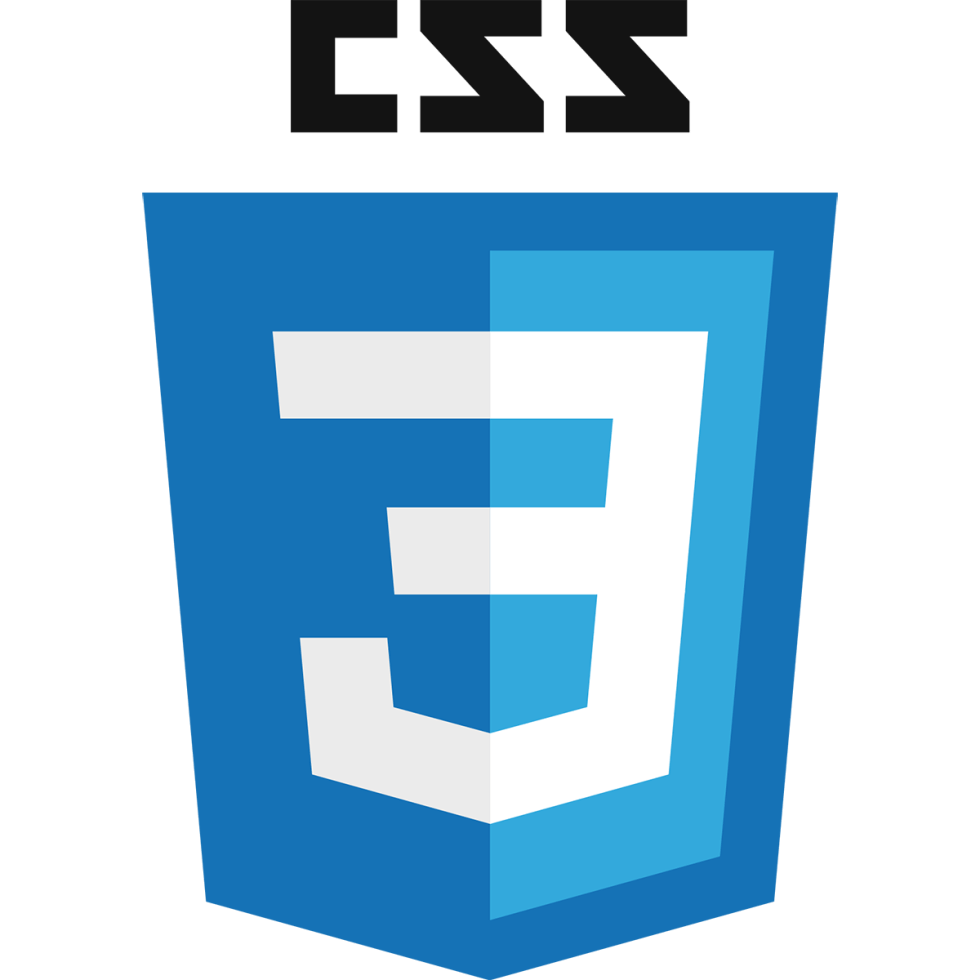
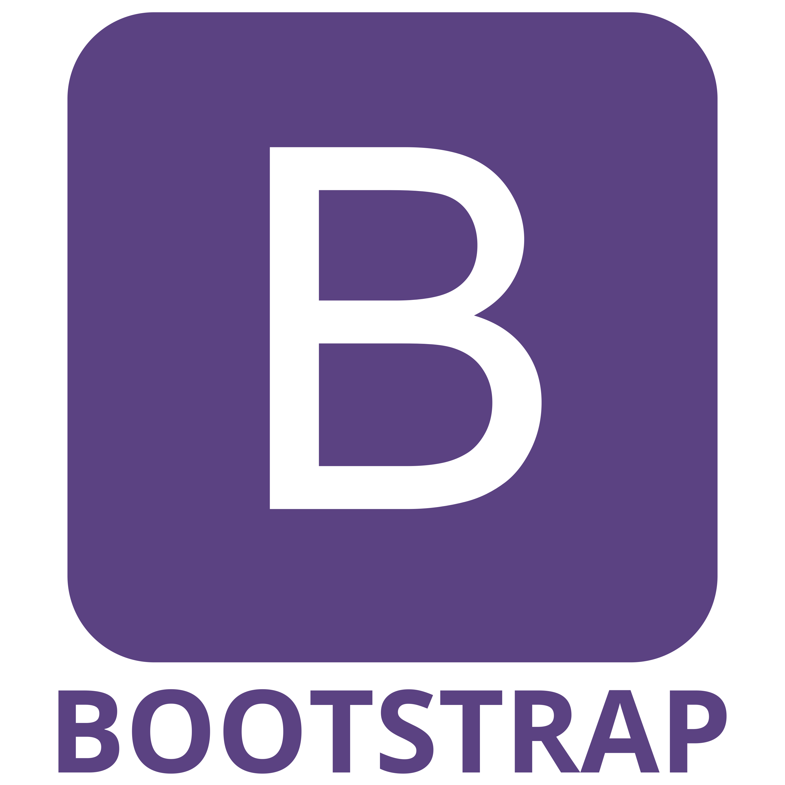
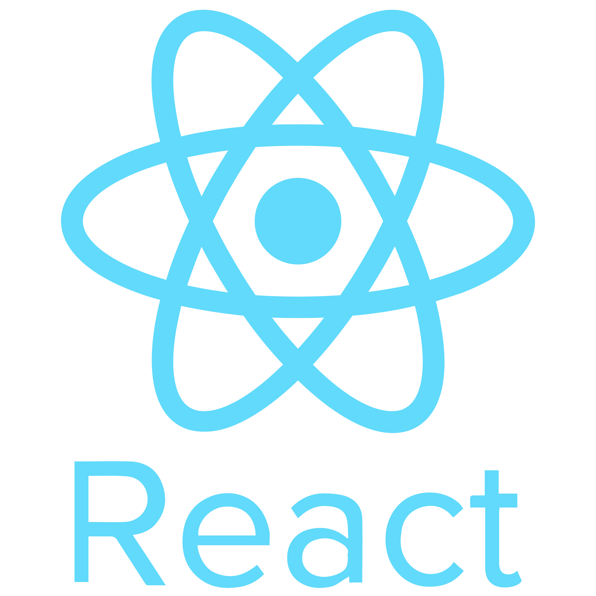

### Assalomu alaykum (Hi). I'm Kenjayev Azizbek👋
I am software developer
 

### Languages and tools I work with:
 
<code></code>
<code></code>
<code></code>
<code></code>
<code></code>
<code></code>

 
 
 
<ul>
  <li>📍   Current location: Uzbekistan Toshkent</li>
  <li>📝  Ask me about anything, I am happy to help.</li>
  <li>📨  How to reach me: <a href="https://www.instagram.com/kenjayev.azizbek_/" target="_blank">@kenjayev.azizbek_</a></li>
</ul>

<!--
**kenjayev/kenjayev** is a ✨ _special_ ✨ repository because its `README.md` (this file) appears on your GitHub profile.

Here are some ideas to get you started:

- 🔭 I’m currently working on ...
- 🌱 I’m currently learning ...
- 👯 I’m looking to collaborate on ...
- 🤔 I’m looking for help with ...
- 💬 Ask me about ...
- 📫 How to reach me: ...
- 😄 Pronouns: ...
- ⚡ Fun fact: ...
-->
